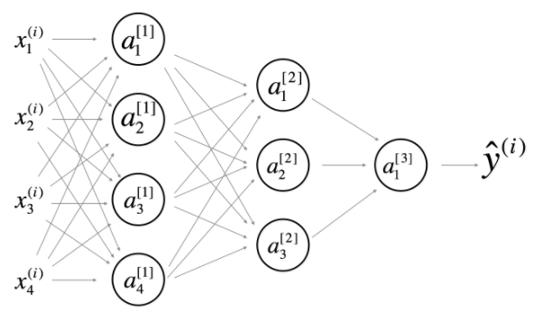

# Week4 Quiz: Key concepts on Deep Neural Networks

1. What is the "cache" used for in our implementation of forward propagation and backward propagation?
   - [x] We use it to pass variables computed during forward propagation to the corresponding backward propagation step. It contains useful values for backward propagation to compute derivatives.
   - [ ] It is used to cache the intermediate values of the cost function during training.
   - [ ] We use it to pass variables computed during backward propagation to the corresponding forward propagation step. It contains useful values for forward propagation to compute activations.
   - [ ] It is used to keep track of the hyperparameters that we are searching over, to speed up computation.

2. Among the following, which ones are "hyperparameters"? (Check all that apply.)
   - [ ] bias vectors b[l]
   - [x] number of layers L in the neural network
   - [ ] weight matrices W[l]
   - [x] number of iterations
   - [x] learning rate α
   - [ ] activation values a[l]
   - [x] size of the hidden layers n[l]
   
3. Which of the following statements is true?
   - [x] The deeper layers of a neural network are typically computing more complex features of the input than the earlier layers.
   - [ ] The earlier layers of a neural network are typically computing more complex features of the input than the deeper layers.

4. Vectorization allows you to compute forward propagation in an L-layer neural network without an explicit for-loop (or any other explicit iterative loop) over the layers l=1, 2, …,L. True/False?
   - [ ] True
   - [x] False

5. Assume we store the values for n[l] in an array called layers, as follows: layer_dims = [nx, 4,3,2,1]. So layer 1 has four hidden units, layer 2 has 3 hidden units and so on. Which of the following for-loops will allow you to initialize the parameters for the model?
   - [ ] 
        ```
        for(i in range(1, len(layer_dims)/2)):
          parameter[‘W’ + str(i)] = np.random.randn(layers[i], layers[i-1])) * 0.01
          parameter[‘b’ + str(i)] = np.random.randn(layers[i], 1) * 0.01
        ```
   - [ ]
        ```
        for(i in range(1, len(layer_dims)/2)):
          parameter[‘W’ + str(i)] = np.random.randn(layers[i], layers[i-1])) * 0.01
          parameter[‘b’ + str(i)] = np.random.randn(layers[i-1], 1) * 0.01
        ```
   - [ ]
        ```
        for(i in range(1, len(layer_dims))):
          parameter[‘W’ + str(i)] = np.random.randn(layers[i-1], layers[i])) * 0.01
          parameter[‘b’ + str(i)] = np.random.randn(layers[i], 1) * 0.01
        ```
   - [x]
        ```
        for(i in range(1, len(layer_dims))):
          parameter[‘W’ + str(i)] = np.random.randn(layers[i], layers[i-1])) * 0.01
          parameter[‘b’ + str(i)] = np.random.randn(layers[i], 1) * 0.01
        ```    
 6. Consider the following neural network.
      <br/><br/>
    How many layers does this network have?
    - [x] The number of layers L is 4. The number of hidden layers is 3.
    - [ ] The number of layers L is 3. The number of hidden layers is 3.
    - [ ] The number of layers L is 4. The number of hidden layers is 4.
    - [ ] The number of layers L is 5. The number of hidden layers is 4.
    
7. During forward propagation, in the forward function for a layer l you need to know what is the activation function in a layer (Sigmoid, tanh, ReLU, etc.). During backpropagation, the corresponding backward function also needs to know what is the activation function for layer l, since the gradient depends on it. True/False?
    - [x] True
    - [ ] False
   
8. There are certain functions with the following properties:
   (i) To compute the function using a shallow network circuit, you will need a large network (where we measure size by the number of logic gates in the network), but (ii) To compute it using a deep network circuit, you need only an exponentially smaller network. True/False?
    - [x] True
    - [ ] False
    
9. Consider the following 2 hidden layer neural network:
  <br/><br/>
  Which of the following statements are True? (Check all that apply).
   - [x] W[1] will have shape (4, 4)
   - [x] b[1] will have shape (4, 1)
   - [ ] W[1] will have shape (3, 4)
   - [ ] b[1] will have shape (3, 1)
   - [x] W[2] will have shape (3, 4)
   - [ ] b[2] will have shape (1, 1)
   - [ ] W[2] will have shape (3, 1)
   - [x] b[2] will have shape (3, 1)
   - [ ] W[3] will have shape (3, 1)
   - [x] b[3] will have shape (1, 1)
   - [x] W[3] will have shape (1, 3)
   - [ ] b[3] will have shape (3, 1)
   
 10. Whereas the previous question used a specific network, in the general case what is the dimension of W^{[l]}, the weight matrix associated with layer l?
      - [ ] W[l] has shape (n[l], n[l+1])
      - [ ] W[l] has shape (n[l−1], n[l])
      - [ ] W[l] has shape (n[l+1], n[l])
      - [x] W[l] has shape (n[l], n[l−1])
