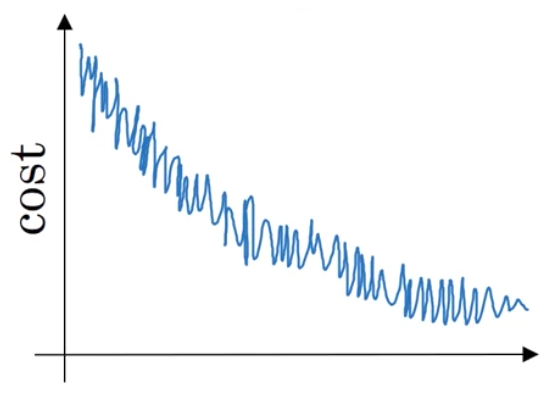
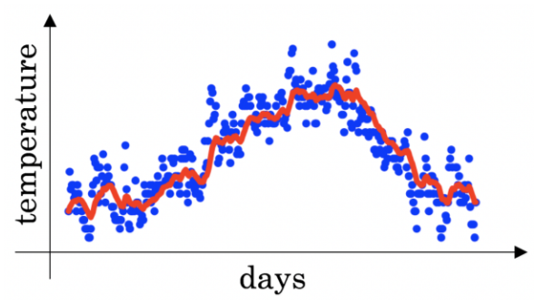
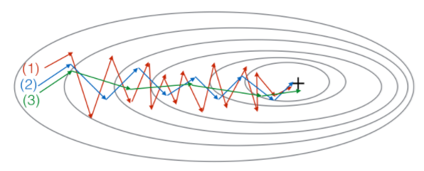

# Week2 Quiz: Optimization algorithms

1. Which notation would you use to denote the 3rd layer’s activations when the input is the 7th example from the 8th minibatch?
   - [ ] a^[3]{7}(8)
   - [x] a^[3]{8}(7)
   - [ ] a^[8]{7}(3)
   - [ ] a^[8]{3}(7)
   
2. Which of these statements about mini-batch gradient descent do you agree with?
   - [ ] You should implement mini-batch gradient descent without an explicit for-loop over different mini-batches, so that the algorithm processes all mini-batches at the same time (vectorization).
   - [x] One iteration of mini-batch gradient descent (computing on a single mini-batch) is faster than one iteration of batch gradient descent.
   - [ ] Training one epoch (one pass through the training set) using mini-batch gradient descent is faster than training one epoch using batch gradient descent.

3. Why is the best mini-batch size usually not 1 and not m, but instead something in-between?
   - [x] If the mini-batch size is 1, you lose the benefits of vectorization across examples in the mini-batch.
   - [ ] If the mini-batch size is m, you end up with stochastic gradient descent, which is usually slower than mini-batch gradient descent.
   - [ ] If the mini-batch size is 1, you end up having to process the entire training set before making any progress.
   - [x] If the mini-batch size is m, you end up with batch gradient descent, which has to process the whole training set before making progress.
   
4. Suppose your learning algorithm’s cost J, plotted as a function of the number of iterations, looks like this:
     
   Which of the following do you agree with?
   - [ ] Whether you’re using batch gradient descent or mini-batch gradient descent, something is wrong.
   - [ ] Whether you’re using batch gradient descent or mini-batch gradient descent, this looks acceptable.
   - [ ] If you’re using mini-batch gradient descent, something is wrong. But if you’re using batch gradient descent, this looks acceptable.
   - [x] If you’re using mini-batch gradient descent, this looks acceptable. But if you’re using batch gradient descent, something is wrong.
   
5. Suppose the temperature in Casablanca over the first three days of January are the same:
    Jan 1st: θ1=10oC
    Jan 2nd: θ210oC
    (We used Fahrenheit in lecture, so will use Celsius here in honor of the metric world.)
    Say you use an exponentially weighted average with β=0.5 to track the temperature: v0=0, vt=βvt−1+(1−β)θt. If v2 is the value computed after day 2 without bias correction, and vcorrected2 is the value you compute with bias correction. What are these values? (You might be able to do this without a calculator, but you don't actually need one. Remember what is bias correction doing.)
    
   - [ ] v2=10, v^corrected_2=10
   - [ ] v2=7.5, v^corrected_2=7.5
   - [ ] v2=10, v^corrected_2=7.5
   - [x] v2=7.5, v^corrected_2=10

6. Which of these is NOT a good learning rate decay scheme? Here, t is the epoch number.
   - [x] α=e^t * α0
   - [ ] α=0.95^t * α0
   - [ ] α=1/(1+2∗t) * α0
   - [ ] α=1/√t * α0

7. You use an exponentially weighted average on the London temperature dataset. You use the following to track the temperature: vt=βvt−1+(1−β)θt. The red line below was computed using β=0.9. What would happen to your red curve as you vary β? (Check the two that apply)
     
   - [ ] Decreasing β will shift the red line slightly to the right.
   - [x] Increasing β will shift the red line slightly to the right.
   - [x] Decreasing β will create more oscillation within the red line.
   - [ ] Increasing β will create more oscillations within the red line.

8. Consider this figure:
   These plots were generated with gradient descent; with gradient descent with momentum (β = 0.5) and gradient descent with momentum (β = 0.9). Which curve corresponds to which algorithm?
        
   - [ ] (1) is gradient descent.(2) is gradient descent with momentum (large β). (3) is gradient descent with momentum (small β)
   - [ ] (1) is gradient descent with momentum (small β). (2) is gradient descent. (3) is gradient descent with momentum (large β)
   - [x] (1) is gradient descent. (2) is gradient descent with momentum (small β). (3) is gradient descent with momentum (large β)
   - [ ] (1) is gradient descent with momentum (small β), (2) is gradient descent with momentum (small β), (3) is gradient descent

9. Suppose batch gradient descent in a deep network is taking excessively long to find a value of the parameters that achieves a small value for the cost function J(W[1],b[1],...,W[L],b[L]). Which of the following techniques could help find parameter values that attain a small value forJ? (Check all that apply)
   - [ ] Try initializing all the weights to zero
   - [x] Try mini-batch gradient descent
   - [x] Try tuning the learning rate α
   - [x] Try better random initialization for the weights
   - [x] Try using Adam
   
10. Which of the following statements about Adam is False?
      - [x] Adam should be used with batch gradient computations, not with mini-batches.
      - [ ] We usually use “default” values for the hyperparameters β1,β2 and ε in Adam (β1=0.9, β2=0.999, ε=10−8)
      - [ ] Adam combines the advantages of RMSProp and momentum
      - [ ] The learning rate hyperparameter α in Adam usually needs to be tuned.
